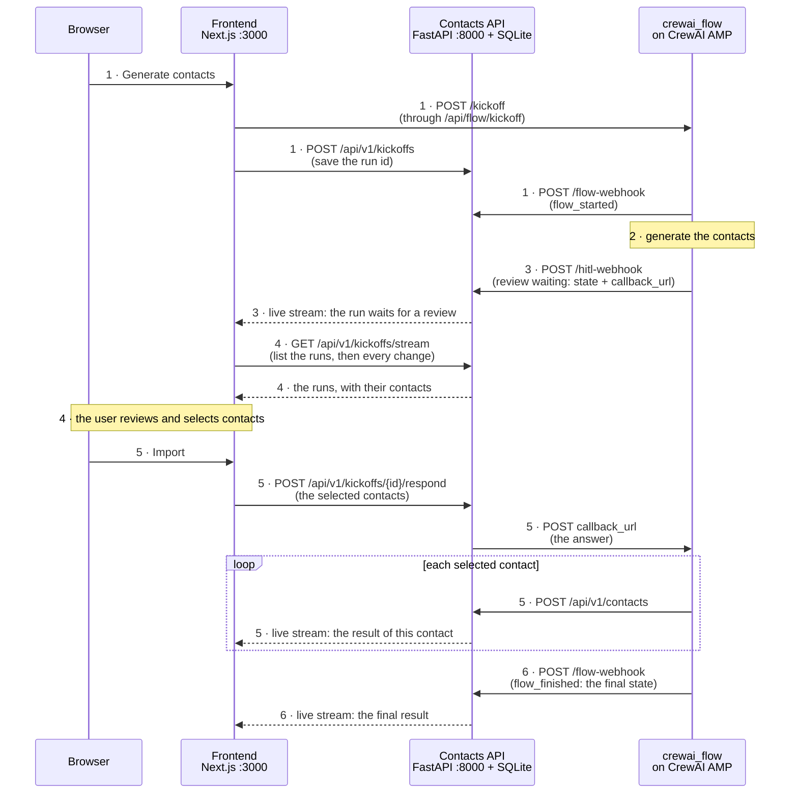

# External App

A small, educational project that shows how an **external application** (a contacts app) can be
integrated with a **CrewAI Flow** that runs on **CrewAI AMP** and has a **human in the loop**.

You will find three projects here, plus one script that starts the app:

| Project | What it is | Tech | Runs |
|---|---|---|---|
| [`external_app/backend`](external_app/backend/README.md) | Contacts API (CRUD), the runs of the import (live, by Server-Sent Events) and the AMP webhooks | FastAPI, SQLAlchemy, SQLite | your machine, `:8000` |
| [`external_app/frontend`](external_app/frontend/README.md) | Web UI to manage contacts, start imports and follow them live | Next.js, TypeScript, Tailwind | your machine, `:3000` |
| [`crewai_flow`](crewai_flow/README.md) | CrewAI Flow that generates contacts, waits for a human to select the ones to import, and imports them through the contacts API | CrewAI | **CrewAI AMP** |

`crewai_flow` lives outside `external_app` on purpose: it is a separate system that **integrates with**
the external app, it is not part of it. The flow runs **only on AMP**: there is no local copy of its API.
`external_app` (backend and frontend) always runs on your machine.

| Screenshots |
|---|
|<br>Import Contacts Form|
|<br>Contacts Page|

## Quick start

You need: a **CrewAI AMP** account and the `crewai` CLI, **uv**, **Node.js 20+**, and **ngrok** (or another tunnel).

1. **Deploy the flow to AMP**: [Deploy the flow](#1-deploy-the-flow). It gives you the URL and the Bearer
   token of the deployment.
2. **Open a tunnel to the backend and configure the review webhook**:
   [Configure the review webhook](#2-configure-the-review-webhook).
3. **Tell the frontend where the flow is**: after the first `./dev.sh up` creates
   `external_app/frontend/.env.local`, set `CREWAI_FLOW_API_URL` and `CREWAI_FLOW_API_BEARER_TOKEN` there
   ([Point the frontend to AMP](#3-point-the-frontend-to-amp)).
4. **Start the app**:

   ```bash
   ./dev.sh up
   ```

   The first run creates the `.env` files from their examples and installs dependencies, so it takes
   a few minutes. Then open:

   | What | URL |
   |---|---|
   | App (frontend) | http://localhost:3000 |
   | Contacts API docs | http://localhost:8000/docs |

To stop everything: `./dev.sh down`.

### The `dev.sh` commands

`./dev.sh up` (start the backend and the frontend, skipping what already answers), `down` (stop both, the data is kept),
`status` and `logs [backend|frontend]`. Both run in the background, with logs and pids in `.run/` (git-ignored). `up` warns
about the settings that would make an import fail.

## Architecture



The numbers are the steps of [How an import works](#how-an-import-works-end-to-end). Solid arrows are requests, dashed
arrows are what the API pushes to the page (**live stream**, Server-Sent Events: the page never polls). The stream is also
how the page **lists the runs**: when you open (or reload) `/contacts/import`, the first thing it receives is the list.

AMP gives every deployed flow the same endpoints (`/kickoff`, `/status`, `/inputs`, `/healthcheck`) and no way to list
runs, to know when one finishes, or to ask a person. So the **backend** fills the gap: it keeps one row per run
(table `kickoffs`), learns what happens from two webhooks, and pushes every change to the page.

The key idea: **the flow does the work, the app only triggers and answers it.** The browser starts the flow and
sends the human's answer. The flow generates the contacts, waits for a person, and creates each selected one through
the public contacts API (one `POST /api/v1/contacts` per contact, so each has its own result).

### Folder structure

```
.
├── dev.sh                      # one command to start/stop the app
├── external_app/
│   ├── backend/                # Contacts API + SQLite file
│   │   ├── app/                #   core/, models/, schemas/, repositories/, api/ (v1/endpoints + webhook.py), server.py
│   │   └── .env.example
│   └── frontend/               # Next.js UI
│       ├── src/app/            #   pages: /, /contacts, /contacts/import, and api/ (the two proxies: flow and stream)
│       ├── src/components/     #   contacts UI, and import/ (the run list, the review and the result)
│       ├── src/hooks/          #   useKickoffStream (the live runs) and useImportRuns (the import page)
│       ├── src/lib/            #   external-app-api/ (contacts API), flow-api.ts (the flow on AMP), http.ts, runs.ts
│       └── .env.example
└── crewai_flow/                # CrewAI Flow project (deployed to AMP)
    ├── src/crewai_flow/        #   config/, flows/, integrations/, services/, types/
    └── .env.example
```

Each project has its own README with the details. This one explains how they fit together.

## How an import works, end to end

Open `/contacts/import` and follow along (the numbers are the ones of the diagram).

1. **Request.** You choose how many contacts and click *Generate contacts*. The frontend calls `POST /kickoff`
   (through the Next.js server, which adds the token and the `webhooks`). The answer is only a `kickoff_id`, which the
   frontend saves in the backend. The run is listed as `INITIALIZED`.
2. **Generate.** The flow creates fake contacts with plain Python. An invalid `count` ends it here, as `failed`.
3. **Pause (human in the loop).** The flow reaches `@human_feedback`, saves its state and **stops**. AMP sends the review
   webhook (`new_request`) with the state of the flow. The backend saves it in the row of the run (`GENERATED`).
4. **Review.** The page lists the runs through the stream: the list first, then every change. The run has a *Review*
   button, with a checkbox per contact and **Import N of M**. Everything is saved in the backend, so you can leave and
   come back, even from another browser.
5. **Answer.** The frontend calls `POST /api/v1/kickoffs/{id}/respond`, and the backend posts the answer
   (`{"selected_refs": [1, 3]}`) to the `callback_url` of the webhook (it never reaches the browser). The flow resumes
   and **creates each selected contact itself** through `POST /api/v1/contacts`, with its own result: `imported`,
   `failed` (for example HTTP 409, email already exists) or `pending` (shown as *skipped*, it was not selected).
   **You watch it live:** the backend sees each of those requests, matches the contact (same email) to the run waiting
   for its import and pushes the result, so the contacts go from *waiting* to *imported* or *failed* one by one.
6. **Result.** The flow returns its final state and AMP sends it in `flow_finished`: the run becomes `IMPORTED` (or
   `FAILED`), with the final result of each contact (this is the last word).

A person can also answer in the AMP dashboard or by e-mail, in free text: `all` selects every contact, and text with
refs (`1, 3`) selects those.

### The two webhooks

The `outcome` of a run goes `initialized` → `generated` → `imported` / `failed` (the names of the state of the flow). It
changes by webhooks, so it does not depend on a browser being open:

| | Review request (step 3) | Start and end of the run (steps 1 and 6) |
|---|---|---|
| Set in | The AMP dashboard (Settings → Human in the Loop → Webhooks) | Each kickoff: the `webhooks` object that the Next.js proxy adds |
| Sent to | `<tunnel>/hitl-webhook` | `<EXTERNAL_APP_API_URL>/flow-webhook` |
| Authentication | HMAC signature with the secret AMP generated (`CREWAI_HITL_WEBHOOK_SECRET`) | `Authorization: Bearer <CREWAI_KICKOFF_WEBHOOK_SECRET>`, a secret **you** choose |

AMP **does not retry** a webhook: if the tunnel is down when one is sent, that run stays at the last stage it reached. A
run started in the AMP dashboard (not from this app) has no `webhooks`, so it only appears when its review arrives.

<details>
<summary><b>What AMP really sends</b> (checked on a real deployment): for whoever changes the webhooks</summary>

The AMP docs are not always up to date, so the code follows what a **real deployment** sends (the webhook checks were
made on 8 captured webhooks, with the ngrok inspector at http://localhost:4040).

- The `/status` of a **paused** flow: `PAUSED` / `awaiting_human_feedback`, without the contacts. Of a
  **finished** flow: `state: "SUCCESS"`, and `result` / `result_json` hold the final state of the flow as an
  object (not as text, as the docs suggest). The app no longer asks for it: Webhook Streaming replaced it.
- **Webhook Streaming** works for Flows, even though the docs only talk about crews in some places. It is set
  per kickoff (`webhooks` in the body of `POST /kickoff`), not in the dashboard. Only the events listed in
  "Supported Events" are asked (`flow_started`, `flow_finished`, `method_execution_failed`): the ones of the
  review (`flow_paused`, `human_feedback_*`) are not documented there, and AMP delivers only what was asked.
  AMP sends one request per event, `{"events": [{id, execution_id, timestamp, type, data}]}`, with
  `Authorization: Bearer <token>` and **no signature**. The order is not guaranteed.
  - `execution_id` is the `kickoff_id` only until the flow pauses. After the answer there is another one,
    so the app uses `data.inputs.id` (in the first `flow_started`) and `data.state.id` (in `flow_finished`),
    which are the `kickoff_id`.
  - `flow_finished` carries the final state: `outcome`, `error`, `selected_refs` and the contacts with the result
    of each one. The `flow_started` of the resume has no `inputs`.
  - **Not observed yet**: `method_execution_failed` (a crash). It does not say which run failed, so the
    backend only logs it, and a run that crashes after the review stays at `generated`.
- **There is no `POST /resume`** for a flow: the deployment answers `404 Not Found`, so the answer goes to
  the `callback_url`. Answering that URL with `{"feedback": "...", "source": "..."}` resumed the flow, and the
  `@router` read the JSON of the answer.
- The **webhook body** is flat (the docs nest it under `request`): `event_type: "new_request"`, `id`,
  `status`, `flow_id`, `flow_class`, `method_name`, `message`, `output`, `emit`, `state` (the flow state at
  the pause), `metadata`, `created_at`, `callback_url`, `response_token`, `deployment_id`,
  `deployment_name`, `assigned_to_email`, `assigned_at`. The headers are `X-Crewai-Signature` (`sha256=<hex>`,
  the HMAC of `"{timestamp}.{body}"` with the whole secret, `whsec_` included) and `X-Crewai-Timestamp`; the
  `callback_url` is on `app.crewai.com`. The `output` is the return of the review step, but it was the
  contacts as JSON text and may change with the deployed version, so the app ignores it.
- What to review is `state.contacts`: the flow state at the pause. If the
  contacts are not found, look at what AMP really sends (the ngrok inspector) and adapt `receive_hitl_webhook()` in
  `external_app/backend/app/api/webhook.py`.
- The `callback_url` and the `response_token` allow answering the review, so the backend keeps them but
  never returns them.

Also:

- **No local persistence.** The flow no longer saves its own state (the platform does it on AMP). It paused and
  resumed correctly in the test, so this works.

</details>

## Deploy and configure

### 1. Deploy the flow

`crewai_flow` is a **subfolder** of this repository, so AMP needs its **Working directory** setting (without it, AMP
looks for `pyproject.toml` and `uv.lock` at the root and fails with `Cannot find pyproject.toml`).

```bash
git push                 # AMP deploys from GitHub
cd crewai_flow
crewai login
crewai deploy create     # reads crewai_flow/.env and asks you to confirm the variables
```

Then, in the AMP dashboard, **Settings → General → Working directory**: fill in the subfolder (in our setup
`crewai_external_app_integration/crewai_flow`: the repository name, then the subfolder), **Save Changes**, and deploy
again with `crewai deploy push` (follow it with `crewai deploy status` and `crewai deploy logs`). After changing the
flow, commit, push and run `crewai deploy push` again.


The flow uses **no LLM and no API key**, but it needs **one environment variable on AMP** (dashboard → deployment →
**Environment Variables**, then redeploy): `EXTERNAL_APP_API_URL`, the public address of the backend (the ngrok address
of the next step, with no path and no trailing slash). The flow creates each selected contact there.

> **`localhost` never works here.** On AMP, `http://localhost:8000` (the default) is the flow's own container, not your
> machine. Without the variable every contact fails with `ConnectError('[Errno 111] Connection refused')`, even though
> the backend is up. The same is true for both webhooks and the kickoff: AMP calls you from the internet, so use the
> tunnel. `FLOW_INCLUDE_DUPLICATE_EMAIL=true` is optional: one contact fails on purpose (HTTP 409).

### 2. Configure the review webhook

Expose the backend with a tunnel (ngrok, Cloudflare Tunnel...) and keep it open while you use the app:

```bash
./dev.sh up
ngrok http 8000          # copy the https://<something>.ngrok-free.app address
```

In the AMP dashboard, **Settings → Human in the Loop → Webhooks**: fill the URL, click **Add**, then **Save Configuration**
(without it the webhook is not stored):

```
https://<something>.ngrok-free.app/hitl-webhook
```


Copy the secret of the webhook (`whsec_...`) into `CREWAI_HITL_WEBHOOK_SECRET` in `external_app/backend/.env` and
restart the backend. AMP signs every webhook (HMAC-SHA256), and the API refuses an unsigned, wrongly signed or old
(over 5 minutes) request, and every request while the secret is not set. The path must be **`/hitl-webhook`**: another
one gets `404` in the ngrok inspector (`http://localhost:4040`) and AMP does not retry. The `callback_url` of the webhook
must be on `crewai.com` (`CALLBACK_DOMAIN` in `webhook.py`, not an environment variable).

> **The tunnel exposes the whole contacts API** to the internet (including `DELETE /api/v1/contacts`, which erases every
> contact), and the API has no login. Use it only while you test, with a throwaway address. When the address changes (a
> free ngrok tunnel changes it on every restart), update it in **three** places: the webhook URL in the AMP dashboard,
> `EXTERNAL_APP_API_URL` on AMP, and `EXTERNAL_APP_API_URL` in `external_app/frontend/.env.local` (restart the frontend).

### 3. Point the frontend to AMP

Copy the URL of the deployment and its Bearer token from the AMP dashboard into `external_app/frontend/.env.local`, then
restart the app (`./dev.sh down && ./dev.sh up`):

```bash
CREWAI_FLOW_API_URL=https://<your-flow>.crewai.com
CREWAI_FLOW_API_BEARER_TOKEN=<the Bearer token of the deployment>
```

Only the Next.js server reads them (`src/app/api/flow/[...path]/route.ts`), so the token never reaches the browser.

> **Human in the loop on AMP.** The platform collects the answer: it pauses the flow, lists the request in the **Human in
> the Loop** tab, e-mails the reviewer and sends the webhook. That only works if the flow does **not** set its own
> `provider=` in `@human_feedback` (it would override the platform's, and the run would stay `running` forever).

## Configuration and ports

Default ports: `8000` (API) and `3000` (frontend). The `.env` files are created from `.env.example` by the first
`./dev.sh up`. **Ports are connected**, so change every file in the row:

| If you change... | Edit |
|---|---|
| API port | `external_app/backend/.env` → `API_PORT`<br>`external_app/frontend/.env.local` → `EXTERNAL_APP_API_URL` |
| Frontend port | `external_app/frontend/.env.local` → `FRONTEND_PORT`<br>`external_app/backend/.env` → `CORS_ORIGINS` |

All the variables (after changing a `.env`, restart with `./dev.sh down` then `./dev.sh up`):

| File | Variable | What it is |
|---|---|---|
| `external_app/frontend/.env.local` | `CREWAI_FLOW_API_URL` | The URL of the AMP deployment. Server only |
| `external_app/frontend/.env.local` | `CREWAI_FLOW_API_BEARER_TOKEN` | How the Next.js server calls the flow (not a webhook secret). Server only, never in the browser |
| `external_app/frontend/.env.local` | `EXTERNAL_APP_API_URL` | The backend. **Use the ngrok address** after deploying the flow: AMP sends the run events to `<it>/flow-webhook`. With `localhost` a kickoff is refused |
| `external_app/frontend/.env.local` | `CREWAI_KICKOFF_WEBHOOK_SECRET` | The secret of the kickoff webhook, any value you choose. AMP sends it back as `Authorization: Bearer ...`. Server only |
| `external_app/frontend/.env.local` | `FRONTEND_PORT` | The port of the frontend (only `./dev.sh` reads it) |
| `external_app/backend/.env` | `CREWAI_KICKOFF_WEBHOOK_SECRET` | The same value as in the frontend. Without it, the events are refused (`503`) |
| `external_app/backend/.env` | `CREWAI_HITL_WEBHOOK_SECRET` | The secret of the review webhook, generated by AMP (`whsec_...`) |
| `external_app/backend/.env` | `API_PORT`, `CORS_ORIGINS` | The port of the API (only `./dev.sh` reads it) and the pages allowed to call it from a browser (a JSON list) |
| AMP → Environment Variables | `EXTERNAL_APP_API_URL` | The public (ngrok) address of the backend: where the flow creates the contacts. **Required on AMP** |
| AMP → Environment Variables | `FLOW_INCLUDE_DUPLICATE_EMAIL`, `MAX_CONTACTS_PER_RUN`, `FLOW_DEFAULT_COUNT` | Optional, see the [`crewai_flow` README](crewai_flow/README.md#settings) |
| AMP → Settings → Human in the Loop | webhook URL | `https://<tunnel>/hitl-webhook` |

## Good to know

- **By hand.** `./dev.sh` is only a convenience: `cd external_app/backend && uv venv && uv pip install -r requirements.txt &&
  .venv/bin/uvicorn app.server:app --reload`, and `cd external_app/frontend && npm install && npm run dev`. Without AMP
  you can try only the flow in a terminal: `cd crewai_flow && uv sync && uv run kickoff 5`.
- **Where the data lives.** Contacts and runs are in the SQLite file `external_app/backend/data/external_app.db`
  (git-ignored). Reset with the **Destroy all contacts** / **Delete** buttons, or stop the app and delete the file.
  The state of the flow is on AMP. `./dev.sh down` keeps everything.

## Troubleshooting

| Problem | Likely cause and fix |
|---|---|
| The import page says `CREWAI_FLOW_API_URL` / `CREWAI_FLOW_API_BEARER_TOKEN` is not set, or `Not authenticated` | Fill them (the Bearer token of the AMP deployment) in `external_app/frontend/.env.local` and restart. |
| The import page says it could not reach the flow | Check `CREWAI_FLOW_API_URL` (only the URL) and the deployment (`crewai deploy status`). |
| The page says `Reconnecting...` | The browser lost the live connection to the backend (it is down, or the tunnel is). It retries by itself: check `./dev.sh status` and the tunnel. |
| A CORS error in the browser | The frontend address is missing from `CORS_ORIGINS` (backend). |
| A run stays `INITIALIZED`, or `PAUSED` without the review appearing | A webhook did not arrive (AMP does not retry). Check the URL and **Save Configuration** of the review webhook, `CREWAI_HITL_WEBHOOK_SECRET`, that `CREWAI_KICKOFF_WEBHOOK_SECRET` is the same on both sides, that the tunnel is open, and the ngrok inspector (`/hitl` instead of `/hitl-webhook` gives `404`). |
| The review arrives but has no contacts | The `state` of the webhook has no `contacts`: look at the body in the ngrok inspector and adapt `receive_hitl_webhook()`. |
| Every contact is `failed` with `Connection refused` | The flow cannot reach the backend: on AMP, `EXTERNAL_APP_API_URL` must be the public address, not `localhost`. Set it, redeploy and run again. |
| Answering says `The flow host refused the answer` or `Could not reach the flow host` | The backend could not post to the `callback_url` (it must be on `crewai.com`), or AMP refused it (the text shows its HTTP status). A review accepts one answer: a second gives `409`. |
| Port already in use, or `./dev.sh up` says a service did not answer | `./dev.sh status` shows what answers on each port, and `./dev.sh logs frontend` the full logs (they are in `.run/`). |

## Learn more

- [`external_app/backend/README.md`](external_app/backend/README.md): the API, its layers and endpoints
- [`external_app/frontend/README.md`](external_app/frontend/README.md): the pages, components and settings
- [`crewai_flow/README.md`](crewai_flow/README.md): the Flow, the human-in-the-loop pause and how to try it
- CrewAI AMP API: https://docs.crewai.com/en/api-reference/kickoff
- CrewAI docs: https://docs.crewai.com/en/concepts/flows
